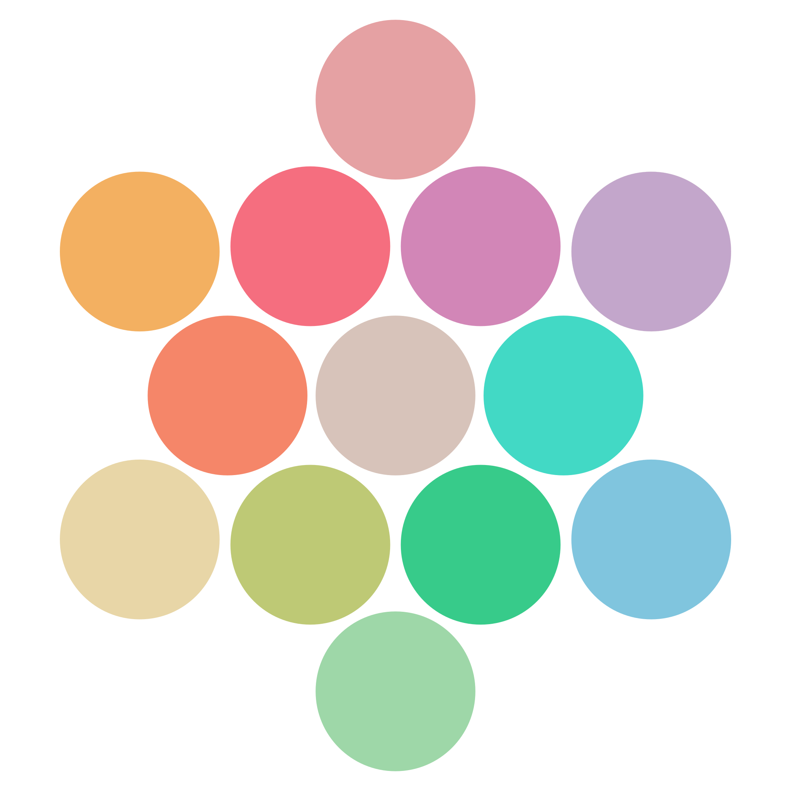

<!--suppress HtmlDeprecatedAttribute -->

# cutiepro theme

## *fearlessly feminine*

tired of drab schemes? after failing to find a theme that resonated with me, I decided
to make my own. meet **cutiepro**, a dark pastel theme emphasizing warm colors and
extraordinarily cute, girly vibes ♡

this repo contains a collection of color scheme configuration files for various terminals and applications. also check out the [plugin for JetBrains IDEs](https://github.com/jezziewezzie/cutiepro-IntelliJ/)!

### palette

|                                                      | name                       |    hex    |
|:----------------------------------------------------:|----------------------------|:---------:|
|                    | `Ansi 0`  — black          | `#000000` |
|                        | `Ansi 1`  — red            | `#f56e7f` |
|                    | `Ansi 2`  — green          | `#bec975` |
|                  | `Ansi 3`  — yellow         | `#f58669` |
|                      | `Ansi 4`  — blue           | `#42d9c5` |
|                | `Ansi 5`  — magenta        | `#d286b7` |
|                      | `Ansi 6`  — cyan           | `#37cb8a` |
|                    | `Ansi 7`  — white          | `#88847f` |
|      | `Ansi 8`  — bright black   | `#2e2a27` |
|          | `Ansi 9`  — bright red     | `#e5a1a3` |
|      | `Ansi 10` — bright green   | `#e8d6a7` |
|    | `Ansi 11` — bright yellow  | `#f3b061` |
|        | `Ansi 12` — bright blue    | `#80c5de` |
|  | `Ansi 13` — bright magenta | `#c3a6cb` |
|        | `Ansi 14` — bright cyan    | `#9ed7a8` |
|      | `Ansi 15` — bright white   | `#d7c3ba` |
|          | background                 | `#181818` |
|          | foreground                 | `#d5d0c9` |
|            | selection                  | `#383838` |

## supported apps
- [Alacritty](https://github.com/alacritty/alacritty/)
- [Dynamic Colors](https://github.com/patelka2211/dynamic-colors/)
- [electerm](https://github.com/electerm/electerm/)
- [Ghostty](https://mitchellh.com/ghostty/)
- [HexChat](https://github.com/hexchat/hexchat/)
- [iTerm2](https://iterm2.com/)
- [kitty](https://github.com/kovidgoyal/kitty/)
- [Konsole](https://github.com/KDE/konsole/)
- [lxterminal](https://github.com/lxde/lxterminal/)
- [MobaXterm](https://mobaxterm.mobatek.net/)
- [pantheon-terminal](https://github.com/elementary/terminal/)
- [PuTTY](https://www.chiark.greenend.org.uk/~sgtatham/putty/)
- [Remmina](https://gitlab.com/Remmina/Remmina/)
- [Rio](https://github.com/raphamorim/rio/)
- [Royal TS](https://royalapps.com/ts/win/features/)
- [Tabby](https://github.com/Eugeny/tabby/)
- [Terminal.app](https://support.apple.com/guide/terminal/welcome/mac/)
- [Terminator](https://github.com/gnome-terminator/terminator/)
- [Termite](https://github.com/thestinger/termite/)
- [Termux](https://github.com/termux/termux-app/)
- [Tilda](https://github.com/lanoxx/tilda/)
- [VHS](https://github.com/charmbracelet/vhs/)
- [Visual Studio Code](https://github.com/microsoft/vscode/)
- [vt](https://man.freebsd.org/cgi/man.cgi?vt)
- [Wayst](https://github.com/91861/wayst/)
- [WezTerm](https://github.com/wez/wezterm/)
- [Windows Terminal](https://github.com/microsoft/terminal/)
- [Xfce Terminal](https://gitlab.xfce.org/apps/xfce4-terminal/)
- [xrdb](https://www.x.org/releases/X11R7.7/doc/man/man1/xrdb.1.xhtml)
- [Xresources](https://www.x.org/releases/X11R7.7/doc/man/man1/xrdb.1.xhtml)
