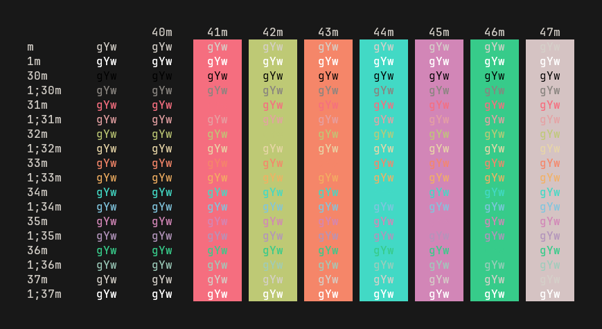

<!--suppress HtmlDeprecatedAttribute -->

# CutiePro — Terminal Schemes

### *Fearlessly feminine.*

Tired of drab schemes? After failing to find a theme that resonated with me, I decided to make my own. Meet **CutiePro**, a dark pastel theme emphasizing warm colors and extraordinarily cute, girly vibes ♡

This repo contains a collection of color scheme configuration files for various terminals and applications. Also check out the **[plugin for JetBrains IDEs](https://github.com/jezziewezzie/CutiePro-IntelliJ/)!**

### Supported apps
- [Alacritty](https://github.com/alacritty/alacritty/)
- [Dynamic Colors](https://github.com/patelka2211/dynamic-colors/)
- [electerm](https://github.com/electerm/electerm/)
- [Ghostty](https://mitchellh.com/ghostty/)
- [HexChat](https://github.com/hexchat/hexchat/)
- [iTerm2](https://iterm2.com/)
- [kitty](https://github.com/kovidgoyal/kitty/)
- [Konsole](https://github.com/KDE/konsole/)
- [lxterminal](https://github.com/lxde/lxterminal/)
- [MobaXterm](https://mobaxterm.mobatek.net/)
- [pantheon-terminal](https://github.com/elementary/terminal/)
- [PuTTY](https://www.chiark.greenend.org.uk/~sgtatham/putty/)
- [Remmina](https://gitlab.com/Remmina/Remmina/)
- [Rio](https://github.com/raphamorim/rio/)
- [Royal TS](https://royalapps.com/ts/win/features/)
- [Tabby](https://github.com/Eugeny/tabby/)
- [Terminal.app](https://support.apple.com/guide/terminal/welcome/mac/)
- [Terminator](https://github.com/gnome-terminator/terminator/)
- [Termite](https://github.com/thestinger/termite/)
- [Termux](https://github.com/termux/termux-app/)
- [Tilda](https://github.com/lanoxx/tilda/)
- [VHS](https://github.com/charmbracelet/vhs/)
- [Visual Studio Code](https://github.com/microsoft/vscode/)
- [vt](https://man.freebsd.org/cgi/man.cgi?vt)
- [Wayst](https://github.com/91861/wayst/)
- [WezTerm](https://github.com/wez/wezterm/)
- [Windows Terminal](https://github.com/microsoft/terminal/)
- [Xfce Terminal](https://gitlab.xfce.org/apps/xfce4-terminal/)
- [xrdb](https://www.x.org/releases/X11R7.7/doc/man/man1/xrdb.1.xhtml)
- [Xresources](https://www.x.org/releases/X11R7.7/doc/man/man1/xrdb.1.xhtml)
