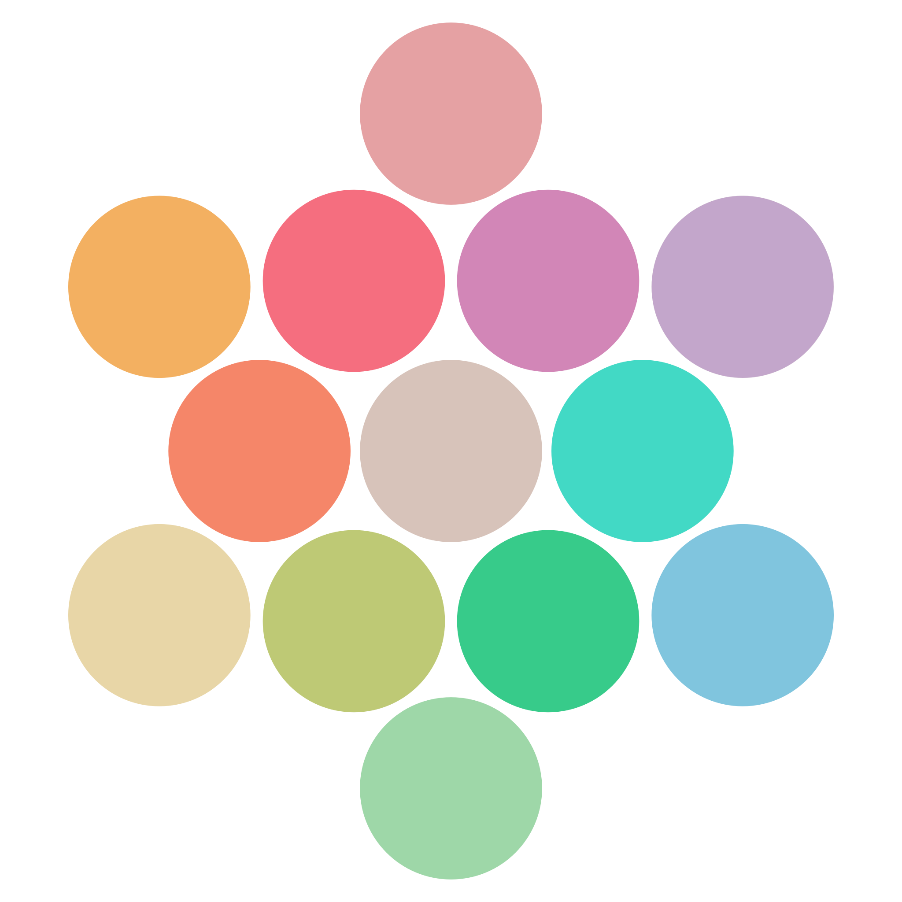

<!--suppress HtmlDeprecatedAttribute -->

# cutiepro theme

## *fearlessly feminine*

tired of drab schemes? after failing to find a theme that resonated with me, I decided to make my own. meet **cutiepro**, a dark pastel theme emphasizing warm colors and extraordinarily cute, girly vibes ♡

this repo contains a collection of color scheme configuration files for various terminals and applications. also check out the [plugin for JetBrains IDEs](https://github.com/jezziewezzie/cutiepro-IntelliJ/)!

### palette

|                                                      | name           | hex       | terminal                                                 | syntax                        | ui                         |
| :---:                                                | :---           | :---:     | :---                                                     | :---                          | :---                       |
|                    | blackboard     | `#181617` | ansi 00 (black), background, selection foreground        |                               | primary background         |
|                        | strawberry     | `#f56e7f` | ansi 01 (red)                                            | keywords, special punctuation | errors, diff minus         |
|                    | sour_apple     | `#bec975` | ansi 02 (green)                                          | strings, raw (markup)         | diff plus                  |
|                  | honeycomb      | `#e8d6a7` | ansi 03 (yellow)                                         | operators, punctuation        | secondary accent           |
|                      | violet         | `#bea2c6` | ansi 04 (blue)                                           | functions                     | info                       |
|                | cherry_blossom | `#e5a1a3` | ansi 05 (magenta), cursor                                | variables, headings (markup)  | primary accent             |
|                      | sky            | `#92bbc9` | ansi 06 (cyan)                                           | constants, lists (markup)     | diff delta                 |
|                    | elephant       | `#88847f` | ansi 07 (white)                                          | comments, quotes (markup)     | light gray                 |
|      | soil           | `#73665b` | ansi 08 (bright black)                                   |                               | inlay hints                |
|          | salmon         | `#f58669` | ansi 09 (bright red)                                     | namespaces, tags              |                            |
|      | leaf           | `#7ac973` | ansi 10 (bright green)                                   | labels                        |                            |
|    | creamsicle     | `#f3b061` | ansi 11 (bright yellow)                                  | types, attributes             | tertiary accent            |
|        | blueberry      | `#9c9de4` | ansi 12 (bright blue)                                    | special strings               |                            |
|  | princess       | `#ed83bb` | ansi 13 (bright magenta)                                 | special                       |                            |
|        | pond           | `#7cbda1` | ansi 14 (bright cyan), url underlines                    | urls/paths                    |                            |
|      | chalk          | `#d5d0c9` | ansi 15 (bright white), foreground, selection background |                               | default text, hints        |
|          | metal          | `#242628` |                                                          |                               | line highlighting          |
|          | film           | `#2e2a27` |                                                          |                               | secondary background       |
|            | ocean          | `#0f3f4e` |                                                          |                               | primary selection          |
|                                                      | concrete       | `#383838` |                                                          |                               | secondary selection        |
|                                                      | lemon          | `#ffef43` |                                                          |                               | high contrast highlighting |

## supported apps
- [Alacritty](https://github.com/alacritty/alacritty/)
- [Dynamic Colors](https://github.com/patelka2211/dynamic-colors/)
- [electerm](https://github.com/electerm/electerm/)
- [Ghostty](https://mitchellh.com/ghostty/)
- [HexChat](https://github.com/hexchat/hexchat/)
- [iTerm2](https://iterm2.com/)
- [kitty](https://github.com/kovidgoyal/kitty/)
- [Konsole](https://github.com/KDE/konsole/)
- [lxterminal](https://github.com/lxde/lxterminal/)
- [MobaXterm](https://mobaxterm.mobatek.net/)
- [pantheon-terminal](https://github.com/elementary/terminal/)
- [PuTTY](https://www.chiark.greenend.org.uk/~sgtatham/putty/)
- [Remmina](https://gitlab.com/Remmina/Remmina/)
- [Rio](https://github.com/raphamorim/rio/)
- [Royal TS](https://royalapps.com/ts/win/features/)
- [Tabby](https://github.com/Eugeny/tabby/)
- [Terminal.app](https://support.apple.com/guide/terminal/welcome/mac/)
- [Terminator](https://github.com/gnome-terminator/terminator/)
- [Termite](https://github.com/thestinger/termite/)
- [Termux](https://github.com/termux/termux-app/)
- [Tilda](https://github.com/lanoxx/tilda/)
- [VHS](https://github.com/charmbracelet/vhs/)
- [Visual Studio Code](https://github.com/microsoft/vscode/)
- [vt](https://man.freebsd.org/cgi/man.cgi?vt)
- [Wayst](https://github.com/91861/wayst/)
- [WezTerm](https://github.com/wez/wezterm/)
- [Windows Terminal](https://github.com/microsoft/terminal/)
- [Xfce Terminal](https://gitlab.xfce.org/apps/xfce4-terminal/)
- [xrdb](https://www.x.org/releases/X11R7.7/doc/man/man1/xrdb.1.xhtml)
- [Xresources](https://www.x.org/releases/X11R7.7/doc/man/man1/xrdb.1.xhtml)
